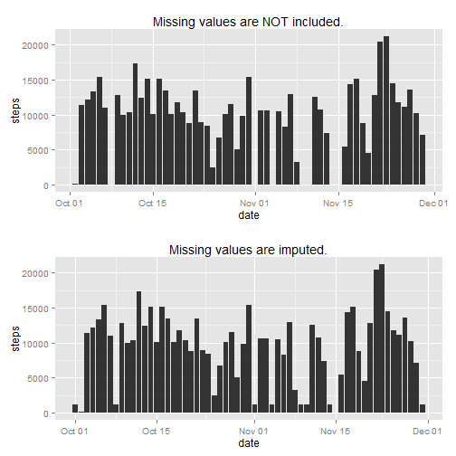
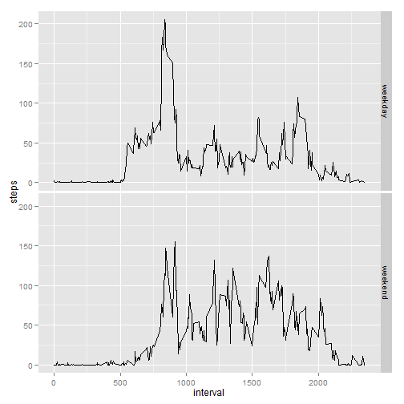

# Reproducible Research: Peer Assessment 1

In this assignment we perform a brif review of a data set available by this link [Dataset: Activity monitoring data [52K]](https://d396qusza40orc.cloudfront.net/repdata%2Fdata%2Factivity.zip). The data consists of two months of data from an anonymous individual collected during the months of October and November, 2012 and include the number of steps taken in 5 minute intervals each day.

The variables included in this dataset are:

* steps: Number of steps taking in a 5-minute interval (missing values are coded as NA)

* date: The date on which the measurement was taken in YYYY-MM-DD format

* interval: Identifier for the 5-minute interval in which measurement was taken

The dataset is stored in a comma-separated-value (CSV) file and there are a total of 17,568 observations in this dataset.

## Loading and preprocessing the data
Let us first load the data and convert data variable to an appropriate format.

```r
if (! exists("DF")){
    file <- unzip("./activity.zip")
    DF <- read.csv(file); 
    file.remove(file)
    }
DF <- transform(DF, date = as.Date(date))
```
We can check what is inside this dataset. 

```r
head(DF)
```

```
##   steps       date interval
## 1    NA 2012-10-01        0
## 2    NA 2012-10-01        5
## 3    NA 2012-10-01       10
## 4    NA 2012-10-01       15
## 5    NA 2012-10-01       20
## 6    NA 2012-10-01       25
```
We see there are some missing values. We will deal with them in a while.

## What is mean total number of steps taken per day?

Now, let us consider how many steps were made in total on each day.

```r
library(ggplot2)
gSD <- ggplot(DF, aes(x = date, y = steps)) + stat_summary(fun.y="sum", geom="bar")
print(gSD)
```

```
## Warning: Removed 2304 rows containing missing values (stat_summary).
```

 

And here we calculate mean and median of total number of steps taken per day

```r
sBd <- aggregate(DF$steps, by=list(DF$date), FUN=sum)
MeanMedian <- c( mean(sBd$x, na.rm=TRUE), median(sBd$x, na.rm=TRUE) )
names(MeanMedian) <- c("mean", "median")
print(MeanMedian)
```

```
##   mean median 
##  10766  10765
```

## What is the average daily activity pattern?
And what about a daily activity? When do we observe higher and lower activity? The following plot shows an activity level during the average day.

```r
library(ggplot2)
g <- ggplot() + stat_summary(data=DF, aes(interval, steps), fun.y="mean", geom="line")
print(g)
```

```
## Warning: Removed 2304 rows containing missing values (stat_summary).
```

 

```r
si <- tapply(DF$steps, DF$interval, mean, na.rm=T)
si[which.max(si)]
```

```
##   835 
## 206.2
```
The maximum of this activity is observed at an interval identified as 835, with the maximal value of steps: 206.1698.

## Imputing missing values
Now let us return to an issue with missing values. We need to address this issue due to the know fact, that meassurements with missing values can bias the results, if not included in analysis. First of all let us figure out how many of them are in the dataset. Here is the total number of missing values of each variable

```r
colSums(is.na(DF))
```

```
##    steps     date interval 
##     2304        0        0
```

Only steps values are misiing. In order to fill in the missin values we will impute them. To do this we will do the following:

* we determine date and time interval corresponding to a missing value
* we find median of steps in that time interval accross all days in dataset
* we find median of steps in that day across all the time intervals
* finally we take average of these two values

```r
DFim <- DF;   
siMedian <- tapply(DF$steps, DF$interval, median, na.rm=T)
sdMedian <- tapply(DF$steps, DF$date, median, na.rm=T)

for ( i in 1:length(DF$steps) ){
    if( is.na(DF[i, "steps"]) ) {
        intName <- DF[i, "interval"]
        dateName <- DF[i, "date"]
        vsi <- siMedian[ names(siMedian)==intName ]
        vsd <- sdMedian[ names(sdMedian)==dateName ]
        
        if( is.na(vsi) ){
            DFim[i, "steps"] <- vsd;
        }else if( is.na(vsd) ){
            DFim[i, "steps"] <- vsi;
        }else{
            DFim[i, "steps"] <- (vsd+vsi)/2;
        }
    }
}
```
Now we check if any missing values are still presented in our new dataset DFim. Bingo. None of them remained NA.

```r
colSums(is.na(DFim))
```

```
##    steps     date interval 
##        0        0        0
```

But what about dependeces we made? Where they changed after we imputed the data?
Now, let us consider how many steps were made in total on each day.

```r
gSD <- ggplot(DF, aes(x = date, y = steps)) + stat_summary(fun.y="sum", geom="bar") + ggtitle("Missing values are NOT included.")
gSDim <- ggplot(DFim, aes(x = date, y = steps)) + stat_summary(fun.y="sum", geom="bar") + ggtitle("Missing values are imputed.")
require(gridExtra)
grid.arrange(gSD, gSDim, ncol=1)
```

```
## Warning: Removed 2304 rows containing missing values (stat_summary).
```

 

Les us also compare mean and median of total number of steps taken per day.

```r
sBd_Im <- aggregate(DFim$steps, by=list(DFim$date), FUN=sum)
MeanMedian_Im <- c( mean(sBd_Im$x, na.rm=TRUE), median(sBd_Im$x, na.rm=TRUE) )
names(MeanMedian_Im) <- c("mean", "median")
print(MeanMedian) # missing data are NOT included
```

```
##   mean median 
##  10766  10765
```

```r
print(MeanMedian_Im) # missing data are imputed
```

```
##   mean median 
##   9504  10395
```
We see there is some difference between values and dependences obtained with and without imputation. Average value decreases more noticable comparing to median value.

## Are there differences in activity patterns between weekdays and weekends?
Now, let us consider if there is a difference between activity during weekdays and weekends. 

```r
wd <- weekdays(DF$date, abbreviate=TRUE)

DFim$day <- "weekday"
DFim[wd == "Sun" | wd == "Sat", "day"] <- "weekend"
DFim <- transform(DFim, day <- as.factor(day))

gDay <- ggplot(DFim) + 
    stat_summary(aes(interval, steps), fun.y="mean", geom="line") + 
    facet_grid(day ~ .) 
print(gDay)
```

 

As we see people tend to shift the activity to daytime during weekends.

This concludes this assignment.
